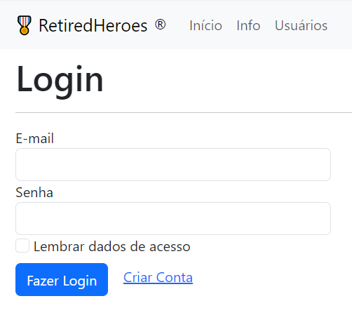

# FlaskWebSite
Criando um site em `Python` com `Flask` e `Bootstrap`.  
  
Esse projeto foi desenvolvido em liguagem `Python` (também utilizando `HTML` e `CSS`) e tem por objetivo colocar em prática algumas funcionalidades das ferramentas `Flask` e `Bootstrap`.  
**Trata-se de uma rede social em formato de blog onde é possível criar usuários e realizar postagens.**  
  
Apesar de simples, o site possui diversas funcionalidades como:  
- Criação e administração de contas de usuários
- Acessos restritos e formatações específicas a usuários logados
- Edição de perfil de contas de usuários com fotos
- Criação e manipulação de banco de dados
- Manipulação de informações no banco de dados
- Manipulação e tratamento de imagens para armazenamento no servidor
- Sistema de postagens de mensagens na página inicial, identificadas pelos usuários autores
- Possibilidade de edição e exclusão das mensagens apenas pelos autores quando logados na página  
  
O projeto consiste em seis arquivos `.py`, sendo:  
[main.py](main.py) - contém o app para executar a página  
[init](flaskwebsite/__init__.py) - com as informações e configurarções base do app  
[forms.py](flaskwebsite/forms.py) - com os objetos (classes) dos formulários para criação de conta, login, edição de perfil, e criação de posts  
[models.py](flaskwebsite/models.py) - com os objetos (classes) de usuário e post com seus atributos  
[routes.py](flaskwebsite/routes.py) - com os caminhos e funções das páginas  
[testes.py](flaskwebsite/testes.py) - com testes executados na elaboração do projeto  
  
Também, onze arquivos `.html`, sendo:  
[base.html](flaskwebsite/templates/base.html) - com os meta dados e configurarções gerais da página  
[navbar.html](flaskwebsite/templates/navbar.html) - com a barra superior e menus que são usados como padrão em todas as páginas  
E os demais arquivos, cada um referente a uma página específica: 
[home](flaskwebsite/templates/home.html), 
[info](flaskwebsite/templates/info.html), 
[criarconta](flaskwebsite/templates/criarconta.html), 
[login](flaskwebsite/templates/login.html), 
[perfil](flaskwebsite/templates/perfil.html), 
[editarperfil](flaskwebsite/templates/editarperfil.html), 
[criarpost](flaskwebsite/templates/criarpost.html), 
[post](flaskwebsite/templates/post.html) e 
[usuarios](flaskwebsite/templates/usuarios.html).

## Home

## Login

## Licença  
Copyright (c) 2023 Felipe Seleme Ribeiro  
